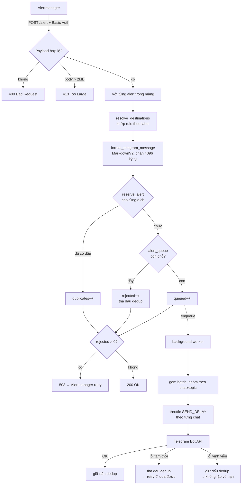

# prometheus-telegram-alert

Webhook receiver nhận alert từ Prometheus Alertmanager, định tuyến theo label và gửi thông báo đến Telegram.

Điểm khác biệt chính so với một script relay thông thường: service chịu trách nhiệm cho từng alert cho tới khi nó thực sự tới nơi — hoặc tới khi biết chắc là gửi lại cũng vô ích — và phân biệt rõ hai loại thất bại đó trong mã HTTP trả về cho Alertmanager.

---

## Mục lục

- [Tính năng](#tính-năng)
- [Kiến trúc và luồng xử lý](#kiến-trúc-và-luồng-xử-lý)
- [Cấu trúc thư mục](#cấu-trúc-thư-mục)
- [Bắt đầu nhanh](#bắt-đầu-nhanh)
- [Thay đổi cần chú ý khi nâng cấp](#thay-đổi-cần-chú-ý-khi-nâng-cấp)
- [Lấy BOT_TOKEN, CHAT_ID và THREAD_ID](#lấy-bot_token-chat_id-và-thread_id)
- [Cấu hình Alertmanager](#cấu-hình-alertmanager)
- [Đặt label cho alert rule](#đặt-label-cho-alert-rule)
- [Biến môi trường](#biến-môi-trường)
- [File routing: telegram_config.json](#file-routing-telegram_configjson)
- [Định dạng tin nhắn](#định-dạng-tin-nhắn)
- [Build image](#build-image)
- [Deploy](#deploy)
- [Endpoint](#endpoint)
- [Ghi chú vận hành](#ghi-chú-vận-hành)
- [Log](#log)
- [Xử lý sự cố](#xử-lý-sự-cố)
- [Bảo mật](#bảo-mật)
- [Giới hạn đã biết](#giới-hạn-đã-biết)
- [Test](#test)

---

## Tính năng

- Nhận webhook từ Alertmanager, gửi alert đến Telegram qua Bot API
- **Multi-chat routing**: route alert sang bot/chat/topic khác nhau dựa theo labels
- **Fan-out**: một alert đi vào nhiều group cùng lúc, qua `targets` hoặc `continue`
- **Dedup alert**: chặn alert trùng trong vòng 30 phút (TTLCache), tính riêng cho từng đích đến
- **Rate limiting**: queue background có giới hạn, throttle theo từng chat, tự retry khi bị Telegram flood control
- **Thread/Topic support**: hỗ trợ `message_thread_id` cho Telegram group có topics
- **Phân loại lỗi**: lỗi tạm thời được retry, lỗi vĩnh viễn bị drop có chủ đích thay vì lặp vô hạn
- Basic Auth (so sánh hằng thời gian) bảo vệ webhook endpoint
- MarkdownV2 format với bảng cấp độ 5 mức theo mục 5.3 ATP: critical ⛔ / major ❗ / minor ⚠️ / warning 🔹 / info ℹ️, resolved ✅, status lạ ❔. Icon chọn theo ngữ nghĩa chứ không theo màu, đọc được cả khi in đen trắng
- Tin FIRING in `Bắt đầu`, tin RESOLVED in `Kết thúc`; tin RESOLVED gắn hậu tố *(firing)* vào Summary/Description vì nội dung hai trường đó là ảnh chụp lúc alert firing
- Tin nhắn luôn được chặn dưới trần 4096 ký tự của Telegram, cắt theo cách không làm hỏng MarkdownV2
- Không mất alert đang nằm trong queue khi redeploy
- Endpoint `/health` cho Docker HEALTHCHECK / liveness probe
- Công cụ kiểm tra config và bắn alert thử, chạy được mà không cần Prometheus

---

## Kiến trúc và luồng xử lý

Một tiến trình, hai luồng: request handler trả lời Alertmanager ngay, còn việc gửi Telegram do một background thread đảm nhiệm.



Ba quyết định thiết kế đáng chú ý:

1. **Trả `200` trước khi gửi.** Alertmanager không phải chờ Telegram, nên không có gunicorn timeout và không có retry vì batch chậm.
2. **Dấu dedup được đặt lúc nhận, không phải lúc gửi xong.** Chặn được alert trùng ngay trong cùng một burst; nếu gửi hỏng vì lỗi tạm thời thì dấu mới được thả ra.
3. **Dedup tính riêng cho từng đích.** Một alert fan-out ra 3 group có 3 dấu độc lập, nên một group lỗi không kéo theo gửi trùng ở hai group kia.

---

## Cấu trúc thư mục

```
.
├── app/
│   ├── __init__.py          # Flask app duy nhất của tiến trình
│   ├── auth.py              # Basic Auth, so sánh hằng thời gian, mặc định admin/admin@123
│   └── flaskAlert.py        # endpoint, format tin, dedup, queue, gửi Telegram
├── config.py                # đọc & chuẩn hoá telegram_config.json thành rule
├── gunicorn.conf.py         # workers=1 (ràng buộc của cache in-memory)
├── Dockerfile               # multi-stage, chạy non-root, có HEALTHCHECK
├── requirements.txt
├── telegram_config.example.json
├── telegram_config.json     # config thật — KHÔNG commit, mount lúc runtime
├── tests/
│   ├── test_all.py          # 103 assertion
│   └── test_fanout.py       # 14 assertion fan-out
└── tools/
    ├── check_config.py      # kiểm tra config + mô phỏng routing
    └── send_test_alert.sh   # bắn alert mẫu, không cần Prometheus
```

---

## Bắt đầu nhanh

```bash
# 1. Cài phụ thuộc
pip install -r requirements.txt

# 2. Tạo config routing
cp telegram_config.example.json telegram_config.json
$EDITOR telegram_config.json

# 3. Kiểm tra config trước khi chạy
python tools/check_config.py telegram_config.json

# 4. Chạy
export DEFAULT_BOT_TOKEN="123:AAA" DEFAULT_CHAT_ID="-100123"
export BASIC_AUTH_USERNAME="alertmgr" BASIC_AUTH_PASSWORD="<mật_khẩu>"
gunicorn -c gunicorn.conf.py app.flaskAlert:app

# 5. Bắn thử một alert
PASS='<mật_khẩu>' ./tools/send_test_alert.sh critical
```

Yêu cầu: Python 3.10+ (image dùng 3.12). Không cần Redis hay database.

---

## Thay đổi cần chú ý khi nâng cấp

1. **Basic Auth không bắt buộc set env.** Thiếu `BASIC_AUTH_USERNAME` / `BASIC_AUTH_PASSWORD` thì biến thiếu lấy mặc định `admin` / `admin@123`, service vẫn khởi động và in `[WARNING] auth` ra log. Biến `ALLOW_INSECURE_AUTH` đã bị bỏ, không còn tác dụng. Cặp mặc định chỉ dành cho lab — production phải set hai biến này.
2. **`telegram_config.json` không còn được đóng gói vào image** (đã đưa vào `.dockerignore`). Phải mount lúc runtime. Thiếu file → chạy chế độ "không mapping", tất cả alert về DEFAULT bot.
3. **Routing chính xác hơn.** Rule dạng cũ giờ chỉ đối chiếu với value của những label nằm trong `PRIORITY_LABELS`. Trước đây một alert có `job="service"` cũng khớp rule `"service"` và bị gửi nhầm chat. Nếu bạn đang *dựa* vào hành vi cũ, hãy khai báo đủ label key vào `PRIORITY_LABELS`.
4. **`/alert` có thể trả `503`.** Khi queue đầy, response trả `503` kèm trường `rejected` để Alertmanager retry. Monitoring nào đang coi "khác 200 là lỗi service" cần cập nhật: `503` ở đây là tín hiệu backpressure có chủ đích, không phải service hỏng.
5. **Response có thêm trường `rejected`.** Trường `dropped` nay chỉ còn nghĩa "payload hỏng, retry vô ích".
6. **Múi giờ hiển thị đổi tên** từ `Asia/Bangkok` sang `Asia/Ho_Chi_Minh` (cùng offset +07, giờ hiển thị không đổi), và cấu hình được qua `DISPLAY_TZ`.
7. **Python 3.12, Flask 3, gunicorn 23.** Nâng gunicorn để vá CVE-2024-1135 (HTTP request smuggling).

---

## Lấy BOT_TOKEN, CHAT_ID và THREAD_ID

**BOT_TOKEN** — nhắn [@BotFather](https://t.me/BotFather) → `/newbot` → nhận chuỗi dạng `8100000001:AAE...`.

**CHAT_ID** — thêm bot vào group, gửi một tin bất kỳ trong group, rồi:

```bash
curl -s "https://api.telegram.org/bot<BOT_TOKEN>/getUpdates" | jq '.result[].message.chat'
```

Group thường có `id` âm; supergroup bắt đầu bằng `-100`.

**MESSAGE_THREAD_ID** — chỉ có với group đã bật Topics. Mở topic trên Telegram Web, ID nằm ở cuối URL; hoặc đọc `message_thread_id` trong output `getUpdates` ở trên.

> Bot phải được **thêm vào group** trước khi gửi được. Bot chưa vào group → Telegram trả `403`, service coi là lỗi vĩnh viễn và drop alert kèm log ERROR.

---

## Cấu hình Alertmanager

Thêm receiver vào `alertmanager.yml`:

```yaml
receivers:
  - name: 'telegram-webhook'
    webhook_configs:
      - url: 'http://<IP_HOST>:9119/alert'
        send_resolved: true
        max_alerts: 0          # 0 = gửi hết, service tự chia batch
        http_config:
          basic_auth:
            username: '<BASIC_AUTH_USERNAME>'
            password: '<BASIC_AUTH_PASSWORD>'

route:
  receiver: 'telegram-webhook'
  group_by: ['alertname', 'site', 'service']
  group_wait: 30s
  group_interval: 5m
  repeat_interval: 4h
```

**Quan hệ giữa `repeat_interval` và `ALERT_REPEAT_INTERVAL`:** Alertmanager gửi lại alert đang firing sau mỗi `repeat_interval`; service chặn trùng trong `ALERT_REPEAT_INTERVAL` (mặc định 30 phút). Chu kỳ nhắc lại thực tế là **giá trị lớn hơn trong hai cái**. Muốn nhắc lại mỗi giờ thì đặt `repeat_interval: 1h` và giữ `ALERT_REPEAT_INTERVAL` ≤ 3600.

**`send_resolved: true`** là bắt buộc nếu muốn nhận tin ✅ RESOLVED.

---

## Đặt label cho alert rule

Routing hoạt động dựa hoàn toàn vào label, nên alert rule bên Prometheus cần mang đủ label để phân biệt. Quy ước đang dùng:

```yaml
groups:
  - name: ceph
    rules:
      - alert: CephOSDNearFull
        expr: ceph_osd_utilization > 80
        for: 10m
        labels:
          severity: critical        # critical | major | minor | warning | info
          site: hpg                 # mã site
          service: ceph             # hệ thống
          role: rgw                 # thành phần (tùy chọn)
        annotations:
          summary: "OSD.{{ $labels.osd }} đạt {{ $value | printf \"%.1f\" }}% dung lượng"
          description: |
            - osd: {{ $labels.osd }}
            - node: {{ $labels.hostname }}
            - mức sử dụng: {{ $value | printf "%.2f" }}%
```

| Label | Vai trò |
|---|---|
| `severity` | Quyết định icon; giá trị gốc được in nguyên ở dòng **Severity**. Giá trị ngoài bảng 5 mức vẫn gửi được nhưng hiển thị ⛔/❔ |
| `site`, `service`, `role`, `product` | Nguyên liệu cho `match` trong `telegram_config.json` |
| `alertname` | Tiêu đề tin |

Mọi label key dùng để routing phải có mặt trong `PRIORITY_LABELS` nếu bạn dùng schema cũ. Với schema `match` thì không cần.

Bỏ trống hẳn `PRIORITY_LABELS` **không** làm rule dạng cũ ngừng khớp — nó quay về hành vi cũ, đối chiếu với **tất cả** label value (kể cả `job`, `instance`), và service log một dòng WARNING lúc boot. Đây chính là hành vi dễ route nhầm mà mục [Thay đổi cần chú ý](#thay-đổi-cần-chú-ý-khi-nâng-cấp) nói tới.

---

## Biến môi trường

| Biến | Bắt buộc | Mặc định | Mô tả |
|------|:--------:|----------|-------|
| `DEFAULT_BOT_TOKEN` | ✓ | — | Token bot Telegram mặc định |
| `DEFAULT_CHAT_ID` | ✓ | — | Chat ID nhận alert mặc định |
| `BASIC_AUTH_USERNAME` | | `admin` | Username Basic Auth. Thiếu → dùng mặc định kèm cảnh báo |
| `BASIC_AUTH_PASSWORD` | | `admin@123` | Password Basic Auth. Thiếu → dùng mặc định kèm cảnh báo |
| `DEFAULT_MESSAGE_THREAD_ID` | | — | Thread/Topic ID mặc định (group có topics) |
| `TELEGRAM_CONFIG_PATH` | | cạnh `config.py` | Đường dẫn file routing. Mặc định là đường dẫn **tuyệt đối** tới `telegram_config.json` nằm cùng thư mục với `config.py` (trong image là `/prometheus-telegram-alert/`), không phụ thuộc CWD của tiến trình gunicorn |
| `ALERT_REPEAT_INTERVAL` | | `1800` | TTL dedup (giây) |
| `ALERT_CACHE_MAXSIZE` | | `20000` | Số entry tối đa của cache dedup |
| `SEND_DELAY` | | `3` | Giây giữa 2 message vào cùng một chat |
| `QUEUE_MAXSIZE` | | `5000` | Giới hạn queue. Đầy → trả **503** để Alertmanager retry |
| `MAX_BATCH` | | `200` | Số job xử lý tối đa trong một batch |
| `LOG_LEVEL` | | `INFO` | `DEBUG` / `INFO` / `WARNING` / `ERROR` |
| `LOG_PAYLOAD` | | `false` | `true` = log nguyên payload webhook ở mức INFO (to, có thể lộ dữ liệu) |
| `ACCESS_LOG` | | tắt | `true` = bật access log của gunicorn |
| `MAX_MESSAGE_CHARS` | | `3800` | Ngân sách ký tự của một message (trần cứng Telegram là 4096) |
| `MAX_FIELD_CHARS` | | `256` | Chặn độ dài một trường ngắn: `alertname`, `severity`, `status`, và timestamp thô khi parse hỏng |
| `MAX_CONTENT_LENGTH_BYTES` | | `2097152` | Kích thước body webhook tối đa. Vượt → 413 |
| `SHUTDOWN_DRAIN_TIMEOUT` | | `20` | Giây chờ gửi nốt queue khi tắt. Phải < `graceful_timeout` (30) |
| `DISPLAY_TZ` | | `Asia/Ho_Chi_Minh` | Múi giờ hiển thị trong message |
| `BIND` | | `0.0.0.0:9119` | Địa chỉ gunicorn lắng nghe |
| `GUNICORN_THREADS` | | `8` | Số thread |
| `GUNICORN_TIMEOUT` | | `120` | Timeout worker (giây) |
| `GUNICORN_LOG_LEVEL` | | `info` | Mức log của gunicorn |

---

## File routing: `telegram_config.json`

Mount vào container tại `/prometheus-telegram-alert/telegram_config.json`.
Nội dung mẫu đầy đủ nằm ở [cuối mục này](#file-mẫu-đầy-đủ); bản trong repo là `telegram_config.example.json`, giống hệt.

> Đổi file này phải **restart container** — config chỉ được đọc một lần lúc boot.
> Key bắt đầu bằng `_` được bỏ qua hoàn toàn → dùng làm ghi chú (JSON không có cú pháp comment).

### Dạng khuyến nghị: `match` theo đúng label key

```json
{
  "PRIORITY_LABELS": ["site", "product"],

  "rules": {
    "storage-hpg": {
      "match": { "site": "hpg", "product": "storage" },
      "BOT_TOKEN": "111111:AAAA",
      "CHAT_ID": "-100111111",
      "MESSAGE_THREAD_ID": "5"
    },

    "network-all-sites": {
      "match": { "product": "network" },
      "BOT_TOKEN": "222222:BBBB",
      "CHAT_ID": "-100222222"
    }
  }
}
```

- `match` là tập điều kiện `label_key: label_value`, phải khớp **tất cả**
- Tên rule tự do — kể cả có dấu `-`, không ảnh hưởng gì đến việc match
- Rule nhiều điều kiện hơn được ưu tiên trước
- Không rule nào khớp → dùng `DEFAULT_BOT_TOKEN` / `DEFAULT_CHAT_ID`
- `MESSAGE_THREAD_ID` tùy chọn; bỏ qua → fallback `DEFAULT_MESSAGE_THREAD_ID`

### Gửi một alert đến nhiều group

Hai cách, dùng riêng hoặc kết hợp.

**Cách 1 — `targets`: một rule, nhiều đích**

```json
"ceph-rgw": {
  "match": { "service": "ceph", "role": "rgw" },
  "targets": [
    { "BOT_TOKEN": "111:AAA", "CHAT_ID": "-100111", "MESSAGE_THREAD_ID": "5" },
    { "BOT_TOKEN": "888:HHH", "CHAT_ID": "-100888" }
  ]
}
```

**Cách 2 — `continue`: nhiều rule cùng khớp** (giống `continue` của Alertmanager route)

```json
"noc-critical": {
  "match": { "severity": "critical" },
  "continue": true,
  "BOT_TOKEN": "999:III", "CHAT_ID": "-100999", "MESSAGE_THREAD_ID": "1"
},
"ceph-hpg": {
  "match": { "site": "hpg", "service": "ceph" },
  "BOT_TOKEN": "222:BBB", "CHAT_ID": "-100222"
}
```

Alert `severity=critical, site=hpg, service=ceph` → vào **cả** group NOC lẫn group Ceph.

- Rule `continue` **luôn được xét trước** mọi rule thường, bất kể số điều kiện — nếu không, một rule thường khớp trước sẽ dừng vòng lặp và rule `continue` không bao giờ chạy
- Vòng lặp dừng ở rule thường (không `continue`) đầu tiên khớp
- Đích trùng nhau (cùng `CHAT_ID` + `MESSAGE_THREAD_ID`) chỉ giữ một lần, không gửi đôi
- Target hỏng (thiếu `BOT_TOKEN`/`CHAT_ID`) bị loại lúc boot, các target còn lại vẫn chạy

**Dedup tính riêng cho từng đích.** Một alert fan-out ra 3 group có 3 dấu dedup độc lập: nếu group 3 gửi lỗi mạng, Alertmanager retry chỉ gửi lại group 3 — group 1 và 2 không bị trùng.

Kiểm tra trước khi deploy:

```bash
python tools/check_config.py telegram_config.json severity=critical site=hpg service=ceph
```

```
-> Khop rule: noc-critical, ceph-hpg
   [1] rule 'noc-critical'  CHAT_ID=-1009999999999  THREAD=1  BOT=8100000009...
   [2] rule 'ceph-hpg'      CHAT_ID=-1002222222222  THREAD=5  BOT=8100000002...
   => alert nay se duoc gui den 2 noi
```

### Dạng cũ (vẫn chạy được)

```json
{
  "PRIORITY_LABELS": ["site", "product", "service"],

  "service":       { "BOT_TOKEN": "...", "CHAT_ID": "..." },
  "site-provider": { "BOT_TOKEN": "...", "CHAT_ID": "..." }
}
```

- Key đơn (`"service"`): khớp khi **một label nằm trong `PRIORITY_LABELS`** có value `"service"`
- Key ghép (`"site-provider"`): khớp khi có cả value `"site"` và `"provider"` — hoặc khi có một label value đúng bằng `"site-provider"` nguyên khối
- Key ghép ưu tiên hơn key đơn

Hạn chế của dạng cũ: không phân biệt được label nào mang value đó, và tên rule không được chứa `-` một cách tự do. Nên chuyển dần sang `match`.

### Thứ tự ưu tiên

1. Rule có `"continue": true` — xét trước tất cả
2. Rule nhiều điều kiện hơn
3. Cùng số điều kiện → rule `match` thắng rule dạng cũ
4. Cùng cả ba → sắp theo tên rule (deterministic giữa các lần boot)

Rule thiếu `BOT_TOKEN`/`CHAT_ID`, hoặc `MESSAGE_THREAD_ID` không phải số, sẽ bị loại/chuẩn hoá ngay lúc boot và ghi log — không để nổ lúc đang xử lý webhook.

### File mẫu đầy đủ

Gộp cả bốn kiểu rule trong một file: `continue`, nhiều `targets`, hai điều kiện, một điều kiện. Copy thành `telegram_config.json` rồi thay token/chat thật.

```json
{
  "PRIORITY_LABELS": ["site", "service", "role", "severity", "product"],

  "rules": {
    "_0": [
      "=== Rule 'continue': khong an alert, chi nhan ban them dich roi xet tiep.",
      "    Luon duoc xet TRUOC moi rule thuong. ==="
    ],

    "noc-critical": {
      "match": { "severity": "critical" },
      "continue": true,
      "BOT_TOKEN": "8100000009:AAExxxxxxxxxxxxxxxxxxxxxxxxxxxxxxxx",
      "CHAT_ID": "-1009999999999",
      "MESSAGE_THREAD_ID": "1"
    },

    "_01": "=== Rule co nhieu dich: 1 alert vao ca group team lan group truc ===",

    "ceph-multi": {
      "match": { "service": "ceph", "role": "rgw" },
      "targets": [
        {
          "BOT_TOKEN": "8100000002:AAExxxxxxxxxxxxxxxxxxxxxxxxxxxxxxxx",
          "CHAT_ID": "-1002222222222",
          "MESSAGE_THREAD_ID": "5"
        },
        {
          "BOT_TOKEN": "8100000008:AAExxxxxxxxxxxxxxxxxxxxxxxxxxxxxxxx",
          "CHAT_ID": "-1008888888888"
        }
      ]
    },

    "_1": "=== 2 dieu kien: cu the nhat, duoc xet truoc ===",

    "openstack-dbp3": {
      "match": { "site": "dbp3", "service": "openstack" },
      "BOT_TOKEN": "8100000001:AAExxxxxxxxxxxxxxxxxxxxxxxxxxxxxxxx",
      "CHAT_ID": "-1001111111111",
      "MESSAGE_THREAD_ID": "12"
    },

    "ceph-hpg": {
      "match": { "site": "hpg", "service": "ceph" },
      "BOT_TOKEN": "8100000002:AAExxxxxxxxxxxxxxxxxxxxxxxxxxxxxxxx",
      "CHAT_ID": "-1002222222222",
      "MESSAGE_THREAD_ID": "5"
    },

    "ceph-hya": {
      "match": { "site": "hya", "service": "ceph" },
      "BOT_TOKEN": "8100000002:AAExxxxxxxxxxxxxxxxxxxxxxxxxxxxxxxx",
      "CHAT_ID": "-1002222222222",
      "MESSAGE_THREAD_ID": "6"
    },

    "_2": "=== 1 dieu kien: bat phan con lai theo service ===",

    "openstack-all": {
      "match": { "service": "openstack" },
      "BOT_TOKEN": "8100000001:AAExxxxxxxxxxxxxxxxxxxxxxxxxxxxxxxx",
      "CHAT_ID": "-1001111111111"
    },

    "ceph-all": {
      "match": { "service": "ceph" },
      "BOT_TOKEN": "8100000002:AAExxxxxxxxxxxxxxxxxxxxxxxxxxxxxxxx",
      "CHAT_ID": "-1002222222222"
    },

    "network": {
      "match": { "service": "network" },
      "BOT_TOKEN": "8100000003:AAExxxxxxxxxxxxxxxxxxxxxxxxxxxxxxxx",
      "CHAT_ID": "-1003333333333"
    },

    "monitoring": {
      "match": { "service": "monitoring" },
      "BOT_TOKEN": "8100000004:AAExxxxxxxxxxxxxxxxxxxxxxxxxxxxxxxx",
      "CHAT_ID": "-1004444444444"
    },

    "_3": "=== Bat theo site cho alert khong co label service ===",

    "site-dbp3": {
      "match": { "site": "dbp3" },
      "BOT_TOKEN": "8100000005:AAExxxxxxxxxxxxxxxxxxxxxxxxxxxxxxxx",
      "CHAT_ID": "-1005555555555"
    }
  }
}
```

Các key `_0`, `_01`, `_1`, `_2`, `_3` chỉ là ghi chú — key bắt đầu bằng `_` bị bỏ qua hoàn toàn, nên dùng được cả string lẫn mảng string.

Với file trên, một alert `severity=critical, site=hpg, service=ceph` đi vào **2 group**: `noc-critical` (rule `continue`, không "ăn" alert) rồi `ceph-hpg`. Kiểm chứng trước khi deploy:

```bash
python tools/check_config.py telegram_config.json severity=critical site=hpg service=ceph
```

### Xử lý file config hỏng

| Tình huống | Hành vi |
|---|---|
| File không tồn tại | WARNING, chạy chế độ không mapping, mọi alert về DEFAULT bot |
| File rỗng | WARNING, như trên |
| File có BOM (soạn trên Windows) | Đọc bình thường (`utf-8-sig`) |
| JSON sai cú pháp | **FATAL, không boot** — thà dừng còn hơn route sai mà không ai biết |
| JSON không phải object `{...}` | **FATAL, không boot** |
| Một rule hỏng | Loại rule đó, log ERROR nêu lý do, các rule còn lại vẫn nạp |

---

## Định dạng tin nhắn

### Bảng cấp độ

| Icon | `severity` |
|:---:|---|
| ⛔ | `critical` |
| ❗ | `major` |
| ⚠️ | `minor` |
| 🔹 | `warning` |
| ℹ️ | `info` |
| ✅ | tin resolved |
| ❔ | status hoặc severity ngoài bảng |

Dòng **Severity** in đúng giá trị gốc của label (`critical`, `major`…) chứ không dịch sang tiếng Việt, để khớp với tên severity trong alert rule và dễ grep.

Icon chọn theo **ký hiệu ngữ nghĩa** chứ không theo màu, để đọc được cả trên nền tối lẫn với người mù màu đỏ/cam.

Một severity lạ khi đang `firing` lấy icon ⛔ chứ không mượn icon của mức `info` — nếu không, một cảnh báo thật sẽ trông y hệt một ghi nhận vô thưởng vô phạt. Status lạ (`suppressed`, chuỗi rỗng, sai chính tả) in nguyên trạng thái kèm ❔ chứ không báo `FIRING`.

### Tin FIRING

```
Status: ⛔ FIRING ⛔
Alertname: CephOSDNearFull
Severity: ⛔ critical
Summary: OSD.12 đạt 82.4% dung lượng
Description:
 - osd: osd.12
 - node: ceph-hpg-03
 - mức sử dụng: 82.41%
Bắt đầu: 2026-09-15 10:04:12
```

### Tin RESOLVED

```
Status: ✅ RESOLVED ✅
Alertname: CephOSDNearFull
Severity: ⛔ critical
Summary (firing): OSD.12 đạt 82.4% dung lượng
Description (firing):
 - osd: osd.12
 - node: ceph-hpg-03
 - mức sử dụng: 82.41%
Kết thúc: 2026-09-15 11:37:55
```

Hậu tố *(firing)* có mặt vì Summary/Description trong payload resolved là ảnh chụp lúc alert đang firing, không phải trạng thái hiện tại. Tin resolved chỉ in `Kết thúc` — mốc bắt đầu đã có trong tin firing gửi trước đó.

Ngoài `severity`, **không label nào khác được đưa lên đầu tin nhắn**. Chi tiết máy chủ, site, osd… đã nằm trong `Description` do alert rule sinh ra; in lại ở trên chỉ làm tin dài gấp đôi.

### Annotation được in

Chỉ ba annotation được đưa vào tin nhắn, theo đúng thứ tự này:

| Annotation | Tiêu đề in ra |
|---|---|
| `info` | `Info` |
| `summary` | `Summary` |
| `description` | `Description` |

Annotation mang tên khác bị bỏ qua hoàn toàn. `info` in **trước** `summary` — dùng cho một dòng ngữ cảnh ngắn cần đọc trước nội dung cảnh báo. Trong tin RESOLVED cả ba tiêu đề đều mang hậu tố *(firing)*.

Khi hết ngân sách ký tự, annotation đang xét bị cắt và những annotation phía sau bị bỏ hẳn — nên trường quan trọng nhất phải là trường đứng trước trong bảng.

### Annotation nhiều dòng

Annotation một dòng dùng inline code; annotation nhiều dòng bọc inline code **từng dòng riêng**:

```
*Description:*
` - Memory use: 96.54031500044677%`
` - level: critical`
` - instance: 10.195.16.206:9012`
```

Hai cách khác đều không dùng được:

- Bọc cả khối bằng một cặp backtick → MarkdownV2 cấm newline trong inline code → Telegram trả `400 can't parse entities`, alert không bao giờ đến nơi
- Dùng pre-block ```` ``` ```` → Telegram vẽ một khung lớn kèm nút "copy", đọc alert rất rối

### Trường thời gian

- Đổi sang `DISPLAY_TZ` (mặc định `Asia/Ho_Chi_Minh`)
- Parse không được → in nguyên bản, vì mất định dạng còn hơn mất hẳn mốc thời gian
- Zero-time của Go (`0001-01-01...`, giá trị `endsAt` của alert đang firing) bị chặn, không sinh dòng rác

---

## Build image

```bash
docker build -t webhook-alert-telegram-python:3.0 .
```

Image dùng multi-stage: toolchain biên dịch nằm ở stage build, không để lại trong image cuối. Runtime chạy bằng user `appuser` (non-root) và có sẵn `HEALTHCHECK`.

## Deploy

```bash
docker run -d \
  --name telegram-bot \
  --restart always \
  -e DEFAULT_BOT_TOKEN="<telegram_bot_token>" \
  -e DEFAULT_CHAT_ID="<telegram_chat_id>" \
  -e DEFAULT_MESSAGE_THREAD_ID="<thread_id>" \
  -e BASIC_AUTH_USERNAME="myuser" \
  -e BASIC_AUTH_PASSWORD="mypassword" \
  -v /path/to/telegram_config.json:/prometheus-telegram-alert/telegram_config.json:ro \
  -p 9119:9119 \
  webhook-alert-telegram-python:3.0
```

### docker-compose

```yaml
services:
  telegram-bot:
    image: webhook-alert-telegram-python:3.0
    container_name: telegram-bot
    restart: always
    ports:
      - "9119:9119"
    environment:
      DEFAULT_BOT_TOKEN: "<telegram_bot_token>"
      DEFAULT_CHAT_ID: "<telegram_chat_id>"
      DEFAULT_MESSAGE_THREAD_ID: "<thread_id>"   # xóa nếu không dùng topics
      BASIC_AUTH_USERNAME: "myuser"
      BASIC_AUTH_PASSWORD: "mypassword"
    volumes:
      - ./telegram_config.json:/prometheus-telegram-alert/telegram_config.json:ro
    healthcheck:
      test: ["CMD", "curl", "-fsS", "http://127.0.0.1:9119/health"]
      interval: 30s
      timeout: 5s
      retries: 3
    stop_grace_period: 40s    # > SHUTDOWN_DRAIN_TIMEOUT + graceful_timeout
```

### Đổi config hoặc nâng cấp

```bash
# Đổi routing: kiểm tra trước, rồi mới restart
python tools/check_config.py telegram_config.json && docker restart telegram-bot

# Nâng cấp image
docker compose pull && docker compose up -d
```

Queue được gửi nốt trong lúc container dừng (tối đa `SHUTDOWN_DRAIN_TIMEOUT`), nên restart không làm mất alert đang chờ. Cần rollback thì chạy lại tag image cũ — service không giữ state nào trên đĩa.

---

## Endpoint

| Method | Path | Auth | Mô tả |
|--------|------|:----:|-------|
| `POST` | `/alert` | ✓ | Nhận webhook Alertmanager |
| `GET` | `/health` | — | Trạng thái worker, queue, cache, số rule đã nạp |

### `POST /alert`

Response:

```json
{
  "status": "ok",
  "queued": 3,
  "duplicates": 1,
  "dropped": 0,
  "rejected": 0
}
```

| Trường | Nghĩa |
|---|---|
| `status` | `ok`, hoặc `overloaded` khi `rejected > 0` (đi kèm HTTP `503`) |
| `queued` | Số job đã vào queue chờ gửi |
| `duplicates` | Bị dedup chặn, không gửi lại |
| `dropped` | Payload dị dạng / không format được — lỗi **vĩnh viễn**, retry vô ích |
| `rejected` | Queue đầy — lỗi **tạm thời**, retry có ích |

| Mã | Khi nào |
|---|---|
| `200` | Xử lý xong. Có thể vẫn có `dropped > 0` |
| `400` | Body không phải JSON object, hoặc thiếu mảng `alerts` |
| `401` | Sai hoặc thiếu Basic Auth |
| `413` | Body vượt `MAX_CONTENT_LENGTH_BYTES` |
| `503` | `rejected > 0` — queue đầy, Alertmanager nên retry |

### `GET /health`

```bash
curl -s http://127.0.0.1:9119/health | jq
```

```json
{
  "status": "ok",
  "worker_alive": true,
  "queue_size": 0,
  "queue_maxsize": 5000,
  "dedup_cache_size": 12,
  "rules_loaded": 3,
  "default_bot_configured": true
}
```

`/health` trả `503` khi background worker chết → container tự restart nhờ HEALTHCHECK.

---

## Ghi chú vận hành

**Workers = 1 (cố định):** dedup dùng in-memory TTLCache. Tăng workers → mỗi worker có cache riêng và một background thread riêng, alert trùng sẽ bị gửi nhiều lần. Để scale horizontal, thay TTLCache bằng Redis (`SET NX EX`) — xem ghi chú trong `app/flaskAlert.py`.

**Webhook trả `200 OK` ngay:** việc gửi Telegram do background thread xử lý, không block request, tránh gunicorn timeout và Alertmanager retry trên batch chậm.

**Rate limiting:** worker giữ mốc thời gian gửi cuối cùng theo từng `(chat_id, thread_id)` và chờ bù đủ `SEND_DELAY` — kể cả giữa hai batch khác nhau. Các chat khác nhau được throttle độc lập, chạy song song.

**Xử lý lỗi gửi:**

| Loại lỗi | Hành động |
|----------|-----------|
| `RetryAfter` (flood control) | Chờ đúng `retry_after` rồi thử lại, tối đa 3 lần |
| `TimedOut` / `NetworkError` | Thử lại sau 3s, tối đa 3 lần |
| `TelegramError` khác | Thử lại sau 3s, tối đa 3 lần |
| Hết retry | **Thả dấu dedup** → Alertmanager retry đi qua được |
| `BadRequest` / `Forbidden` / `InvalidToken` / `ChatMigrated` | **Giữ dấu dedup**, log ERROR, không retry (retry cũng fail y hệt) |
| Không khởi tạo được bot, hoặc exception ngoài dự kiến | **Thả dấu dedup**, không thử lại trong tiến trình — để Alertmanager retry |

**Queue đầy** (`QUEUE_MAXSIZE`): từ chối alert + log ERROR + thả dấu dedup + trả **HTTP 503**, thay vì phình bộ nhớ đến khi OOM. Alertmanager chỉ retry khi nhận 5xx, nên phải phân biệt rõ hai loại thất bại trong response:

| Trường | Nghĩa | HTTP |
|---|---|---|
| `dropped` | payload dị dạng / không format được — lỗi **vĩnh viễn**, retry vô ích | 200 |
| `rejected` | queue đầy — lỗi **tạm thời**, retry có ích | 503 |

**Độ dài message**: Telegram cắt cứng ở 4096 ký tự và trả 400 nếu vượt — mà 400 bị coi là lỗi vĩnh viễn nên alert sẽ biến mất im lặng. Message luôn được cắt trước ở mức `MAX_MESSAGE_CHARS`, cắt theo **giá trị thô trước khi escape** để không làm hỏng entity MarkdownV2, và ưu tiên giữ phần đầu (Status/Alertname/Severity) cùng các mốc thời gian; phần bị lược có dòng đánh dấu ở cuối. Từng trường ngắn (`alertname`, `severity`, `status`, timestamp thô) thêm một trần riêng `MAX_FIELD_CHARS` để một label dài bất thường không ăn hết chỗ của Summary.

**Tắt dịch vụ**: worker là daemon thread nên trước đây mỗi lần redeploy là mất sạch alert đang nằm trong queue. Nay khi tiến trình thoát, service chờ tối đa `SHUTDOWN_DRAIN_TIMEOUT` giây cho worker gửi nốt. Đặt `stop_grace_period` của Docker lớn hơn tổng `SHUTDOWN_DRAIN_TIMEOUT` + `graceful_timeout`.

**Công cụ debug trong container:** `vim`, `telnet`, `nc`, `curl`.

```bash
docker exec -it telegram-bot bash
cat telegram_config.json
nc -zv api.telegram.org 443
```

---

## Log

Log ra stdout/stderr theo định dạng `[thời gian] [mức] nội dung`. stdout nhận mức dưới ERROR, stderr nhận từ ERROR trở lên — không dòng nào bị in hai lần.

Riêng log lúc nạp config và lúc dựng Basic Auth (`config.py`, `app/auth.py`) in thẳng ra stderr theo dạng `[MỨC] config: …` / `[WARNING] auth: …`, **không có timestamp** — hai module này chạy trước khi logger của Flask được cấu hình.

Những dòng đáng chú ý:

| Dòng log | Nghĩa |
|---|---|
| `nap N rule routing: ...` | Số rule nạp được lúc boot. So với số rule trong file để phát hiện rule bị loại |
| `[ERROR] config: rule 'x' ...` | Một rule bị loại, kèm lý do |
| `Rule matched: a, b -> N dich den` | Alert khớp rule nào, ra mấy đích |
| `No rule matched for labels: {...}` | Rơi về DEFAULT bot — kiểm tra lại `PRIORITY_LABELS` hoặc `match` |
| `Duplicate alert (firing) skipped: fp:...` | Bị dedup chặn, đúng như thiết kế |
| `Sent alert to chat_id ... success` | Đã gửi xong |
| `Flood control exceeded. Retry in Ns` | Telegram bắt chờ — cân nhắc tăng `SEND_DELAY` |
| `Permanent Telegram error for chat_id ...` | 400/403/token sai — alert bị drop có chủ đích, cần sửa cấu hình |
| `Queue day (N) - tu choi alert ...` | Backpressure, đang trả 503 |
| `Dedup cache near capacity` | Tăng `ALERT_CACHE_MAXSIZE` hoặc giảm `ALERT_REPEAT_INTERVAL` |
| `Shutdown: cho gui not N alert` | Đang drain queue lúc tắt |

```bash
docker logs --tail 50 -f telegram-bot
docker logs telegram-bot 2>&1 | grep -E "ERROR|WARNING"
```

---

## Xử lý sự cố

| Triệu chứng | Nguyên nhân thường gặp | Cách xử lý |
|---|---|---|
| Log `[WARNING] auth` lúc boot | Thiếu `BASIC_AUTH_USERNAME`/`PASSWORD`, đang chạy bằng `admin`/`admin@123` | Set hai biến này cho môi trường thật |
| Container không boot, log `[FATAL] config` | `telegram_config.json` sai cú pháp JSON | `python tools/check_config.py <file>` để xem lỗi ở đâu |
| Alertmanager báo `401` | Sai `basic_auth` trong `alertmanager.yml` | Đối chiếu lại username/password |
| Alertmanager báo `413` | Batch quá to | Tăng `MAX_CONTENT_LENGTH_BYTES`, hoặc đặt `max_alerts` trong `webhook_configs` |
| Alertmanager báo `503` | Queue đầy — Telegram đang không gửi được | Xem log tìm `Permanent Telegram error` hoặc lỗi mạng; kiểm tra `nc -zv api.telegram.org 443` |
| Alert về DEFAULT bot dù đã có rule | Label dùng để match không nằm trong `PRIORITY_LABELS`, hoặc rule bị loại lúc boot | `python tools/check_config.py <file> site=... service=...` |
| Rule có trong file nhưng không được nạp | Thiếu `BOT_TOKEN`/`CHAT_ID`, hoặc entry không phải object | Xem dòng `[ERROR] config:` lúc boot; `check_config.py` cũng liệt kê entry bị loại |
| Không nhận được tin nào, log `Forbidden` | Bot chưa được thêm vào group, hoặc đã bị kick | Thêm lại bot vào group |
| Log `Chat migrated` | Group đã nâng thành supergroup, `CHAT_ID` đổi | Cập nhật `CHAT_ID` mới theo log rồi restart |
| Tin gửi vào group nhưng sai topic | `MESSAGE_THREAD_ID` sai hoặc không phải số | Xem log `MESSAGE_THREAD_ID=... khong phai so`; lấy lại ID từ `getUpdates` |
| Alert thật bị thiếu, log `Duplicate alert skipped` | Dedup đang chặn trong `ALERT_REPEAT_INTERVAL` | Giảm `ALERT_REPEAT_INTERVAL`, hoặc kiểm tra `repeat_interval` bên Alertmanager |
| Tin bị cắt cuối | Vượt `MAX_MESSAGE_CHARS` | Rút gọn annotation, hoặc tăng `MAX_MESSAGE_CHARS` (trần cứng vẫn là 4096) |
| `/health` trả `503` | Background worker đã chết | Xem log tìm `background_worker error`; container sẽ tự restart nhờ HEALTHCHECK |
| Tin đến chậm khi có nhiều alert | Throttle `SEND_DELAY` theo từng chat | Bình thường — 20 msg/phút/group là trần của Telegram, không vượt được |

Bắn alert thử để khoanh vùng mà không cần đợi Prometheus:

```bash
PASS='<mật_khẩu>' ./tools/send_test_alert.sh           # tất cả mẫu
PASS='<mật_khẩu>' ./tools/send_test_alert.sh critical   # description nhiều dòng
PASS='<mật_khẩu>' ./tools/send_test_alert.sh warning    # description một dòng
PASS='<mật_khẩu>' ./tools/send_test_alert.sh resolved
PASS='<mật_khẩu>' ./tools/send_test_alert.sh dedup      # gửi 2 lần, kiểm chứng dedup

# Đổi đích hoặc user (mặc định http://127.0.0.1:9119/alert và user 'alertmgr')
URL=http://10.0.0.5:9119/alert USER=myuser PASS='<mật_khẩu>' ./tools/send_test_alert.sh critical
```

---

## Bảo mật

- **Không commit `telegram_config.json`** — đã có trong `.gitignore` và `.dockerignore`. File chứa BOT_TOKEN, mount lúc runtime chứ không đóng gói vào image.
- **Luôn set `BASIC_AUTH_*` ở môi trường thật.** Thiếu env thì service tự dùng `admin`/`admin@123` — cặp này nằm công khai trong README nên phải coi như đã lộ; chỉ chấp nhận được trong lab.
- **Không expose cổng 9119 ra Internet.** Endpoint chỉ cần Alertmanager gọi tới — bind vào mạng nội bộ, hoặc đặt sau reverse proxy có TLS.
- **Basic Auth đi qua HTTP là plaintext.** Nếu Alertmanager nằm khác mạng, bọc TLS ở reverse proxy.
- **`/health` không cần auth** và có lộ vài con số vận hành (số rule, kích thước queue). Không nên cho truy cập từ ngoài.
- **`LOG_PAYLOAD=true` ghi nguyên payload vào log**, có thể chứa dữ liệu nội bộ. Chỉ bật khi đang debug.
- Container chạy bằng user non-root, config mount `:ro`.

---

## Giới hạn đã biết

- **Một worker duy nhất.** Dedup dùng cache trong RAM nên không chạy nhiều worker hay nhiều instance được. Muốn HA thì phải chuyển sang Redis trước.
- **Queue không bền.** Nằm trong RAM; drain lúc tắt bình thường, nhưng `kill -9` hoặc mất điện thì mất phần chưa gửi. Alertmanager sẽ gửi lại ở chu kỳ `repeat_interval` kế tiếp.
- **Config đọc một lần lúc boot.** Đổi routing phải restart, không có reload nóng.
- **Trần 20 msg/phút/group là của Telegram**, không lách được. Alert storm vào cùng một group sẽ xếp hàng.
- **Cache dedup mất khi restart**, nên ngay sau restart một alert đang firing có thể được gửi lại một lần.

---

## Test

```bash
pip install -r requirements.txt
python tests/test_all.py      # 103 assertion
python tests/test_fanout.py   # 14 assertion fan-out
```

Không dùng pytest — chạy bằng Python trần, kể cả trên máy chỉ có thư viện của service. Exit code `1` khi có test fail, cắm thẳng vào CI được.

Bộ test dùng Telegram giả lập, không cần token thật. Phạm vi:

| Mục | Nội dung |
|---|---|
| Routing | Cả hai schema, thứ tự ưu tiên, rule hỏng bị loại, fan-out `targets` + `continue` |
| Format | MarkdownV2, bảng cấp độ, status/severity lạ, timestamp hỏng, tin resolved |
| Độ dài | Cắt theo trần 4096, trường ngắn quá dài, message không bao giờ rỗng |
| Fuzz | 3000 payload ngẫu nhiên kiểm bằng validator MarkdownV2 viết riêng |
| Dedup | reserve/release, tính riêng theo đích, lỗi tạm thời vs vĩnh viễn |
| HTTP | Auth, input dị dạng, `/health`, 413, 503 khi queue đầy |
| Đồng thời | `/health` + reserve chạy song song không làm hỏng cache |

Kiểm tra config mà không cần cài gì (chỉ dùng thư viện chuẩn):

```bash
python tools/check_config.py telegram_config.json
python tools/check_config.py telegram_config.json site=dbp3 service=openstack
```

Exit code `1` khi có entry bị loại → cắm được vào CI hoặc chạy trước `docker restart`.